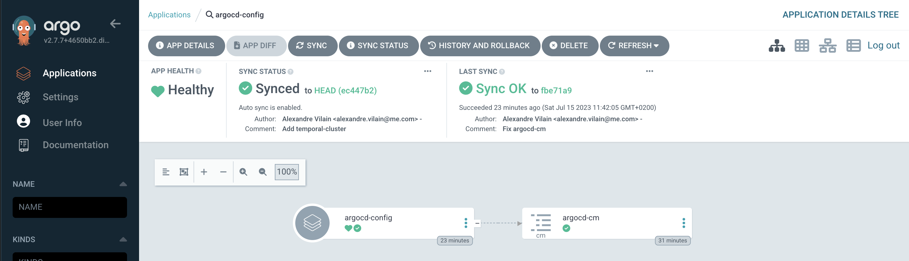
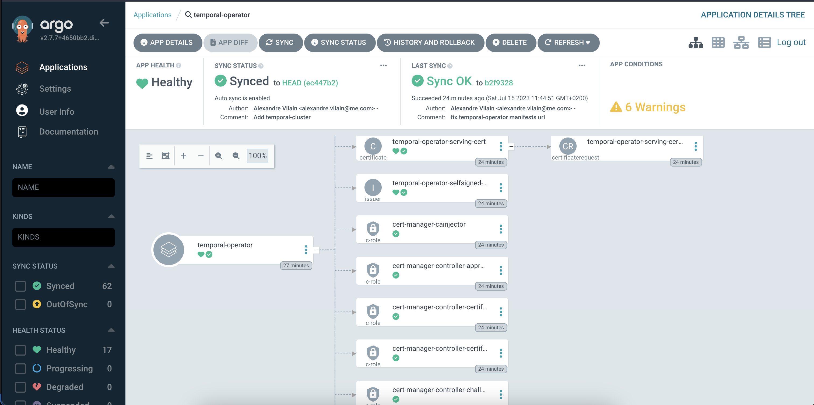

# temporal-operator-demo-argocd


This repository provides demo applications to install temporal-operator and to create a temporal cluster using ArgoCD.

## Step 1: Install Argo CD

Firstly, you need to install Argo CD on your Kubernetes cluster. Follow these steps:

1. Run the following command to install Argo CD:

```
kubectl create namespace argocd
kubectl apply -n argocd -f https://raw.githubusercontent.com/argoproj/argo-cd/v2.7.7/manifests/install.yaml
```

2. Wait for all the Argo CD components to be deployed and running.

3. Get the admin password for Argo CD by running the following command:

```
kubectl get secrets -n argocd argocd-initial-admin-secret -o=template="{{.data.password | base64decode }}"
```

4. Create a port-forward to the ArgoCD server :
```
kubectl port-forward svc/argocd-server -n argocd 8080:443
```

5. Open the ArgoCD web UI in your browser and log in to Argo CD using the username admin and the password you obtained in the previous step.

## Step 2: Create the argocd-cm application

This application installs a customized "argocd-cm" configmap to tell ArgoCD how to report "TemporalCluster" health.
Until this custom health check is not merged in ArgoCD repo, this step is mandatory.

```
kubectl apply -f 00-argocd-cm-application.yaml
```

Then you should see the application on the ArgoCD web UI:




## Step 3: Install temporal-operator application

This application installs the temporal-operator CRDs and components and cert-manager.
This application is not production ready but will work well for this demo.

```
kubectl apply -f 01-temporal-operator-application.yaml
```

Then you should see the application on the ArgoCD web UI:



*Note that ArgoCD show 6 warnings. To fix that an make the Application more "production-ready" consider creating a separate application to install cert-manager using the official helm chart.*

## Step 4: Install demo temporal cluster application

Finish by creating the temporal-cluster application that deploys a demo PostgresSQL instance and a `TemporalCluster`.
The application uses argocd sync-waves to ensure PostgresSQL is up-and-running before creating the TemporalCluster.

```
kubectl apply -f 02-temporal-cluster-application.yaml
```


Congratulations! You have now installed a temporal cluster with Argo CD.
Don't forget to refer to the [official Argo CD documentation](https://argo-cd.readthedocs.io/en/stable/) for more information and details on advanced features.
